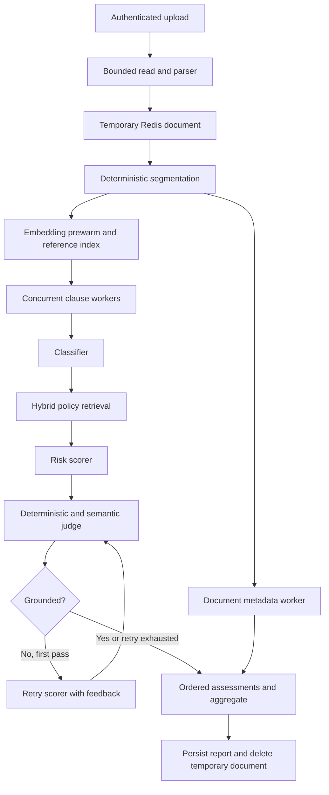

# Contract Clause Risk Reviewer API

FastAPI backend for AI-assisted contract review using a company playbook and
grounded retrieval. It supports document parsing, clause assessment, Google
OAuth and JWT authentication, persistent history, policy management, human
review decisions, audit records, and evaluation.

See the [project overview](../../README.md) and [web setup](../web/README.md).

## Requirements and setup

Use Python 3.12+, PostgreSQL with pgvector, and Redis. Run backend commands
from `apps/backend-fastapi` so relative data paths and `.env` resolve correctly.

From the repository root, start the storage services:

```bash
docker compose -f infrastructure/docker-compose.yml up -d postgres redis
```

Then install the backend:

```bash
cd apps/backend-fastapi
python3 -m venv .venv
source .venv/bin/activate
pip install -e '.[dev]'
cp .env.example .env
```

Edit `.env` before starting the application. Replace API and OAuth placeholders,
generate independent signing secrets, and verify the database and Redis URLs.
For example, generate each signing secret independently:

```bash
python -c 'import secrets; print(secrets.token_urlsafe(48))'
```

```bash
alembic upgrade head
python -m scripts.ingest_playbook
uvicorn app.main:app --reload
```

The API listens on `http://localhost:8000`; Swagger documentation is at `/docs`.
Ingestion creates vectors for the supplied playbook. Without relevant positions,
the scorer cannot provide a supported known-risk assessment.

The repository also includes `uv.lock`. If using uv, install with `uv sync --frozen
--extra dev` and run commands through `uv run` or the resulting virtual environment.

### Docker Compose

Configure this directory's `.env`, then run from the repository root:

```bash
docker compose -f infrastructure/docker-compose.yml up --build -d
```

The API image uses Python 3.12 and installs locked runtime dependencies. Its
entrypoint applies migrations and ingests the playbook only when the vector
store is empty. `FORCE_PLAYBOOK_INGEST=1` forces ingestion. Compose points API
database/Redis URLs at service names; OAuth and frontend URLs are addresses
resolved by the browser, so they use published host ports.

PostgreSQL normally uses host port 5432. The latest evaluation used a separate
project database on 55432 because an unrelated application occupied 5432.
Choose the URL for your actual project database; do not reuse another app's
database merely because it listens on the default port.

## Configuration

Settings are defined in [app/config.py](app/config.py), loaded from `.env`, and
cached per process. Process environment variables take precedence. Restart the
backend after changes; source-file reload does not reliably reload `.env`.
Unknown environment keys are ignored, while required settings without defaults
must be supplied.

### Core and authentication

| Variable | Default or requirement | Purpose |
|---|---|---|
| `DATABASE_URL` | Required | SQLAlchemy PostgreSQL connection URL |
| `REDIS_URL` | `redis://localhost:6379/0` | Temporary contracts, optional reports, embedding cache |
| `APP_ENV` | `development` | Development sign-in environment gate |
| `FRONTEND_URL` | `http://localhost:5173` | Frontend origin for CORS and authentication redirects |
| `GOOGLE_OAUTH_API` | Required | Google OAuth client ID |
| `GOOGLE_KEY_SECRET` | Required | Google OAuth client secret |
| `GOOGLE_REDIRECT_URI` | `http://localhost:8000/auth/google/callback` | Registered OAuth callback |
| `SESSION_SECRET_KEY` | Required | Signs the OAuth session cookie |
| `JWT_SECRET_KEY` | Required | Signs bearer access tokens |
| `JWT_ALGORITHM` | `HS256` | JWT signing algorithm |
| `ACCESS_TOKEN_EXPIRE_MINUTES` | `720` | Access token lifetime |
| `ENABLE_DEV_LOGIN` | `false` | Additional development sign-in gate |
| `PLAYBOOK_ADMIN_EMAILS` | Empty | Comma-separated email allow-list for playbook writes |
| `MAX_UPLOAD_BYTES` | `10485760` | Bounded upload limit: 10 MiB |
| `MAX_CLAUSES` | `300` | Clause count limit before review calls |

Google settings remain required even when development sign-in is used. Local
testing may use placeholders for unused Google credentials, but real Google
sign-in requires valid credentials and a matching registered callback.

An empty playbook admin allow-list allows every authenticated user to write.
Set it explicitly to restrict `POST`, `PUT`, and `DELETE`; email matching is
case-insensitive. Authenticated reads remain available.

### Chat and embeddings

| Variable | Code default | Purpose |
|---|---|---|
| `LLM_PROVIDER` | `gemini` | Chat adapter selection |
| `LLM_MODEL` | Provider-dependent | Model identifier; required for OpenRouter/OpenAI-compatible hosts |
| `LLM_API_KEY` | Unset | Explicit key override; otherwise use the provider-specific key |
| `LLM_BASE_URL` | Provider-dependent | Custom OpenAI-compatible endpoint |
| `LLM_OPENROUTER_PROVIDERS` | `[]` | JSON list restricting OpenRouter endpoints |
| `LLM_THINKING` | `disabled` | Disable reasoning where supported; `auto` uses the host default |
| `LLM_TIMEOUT_SECONDS` | `120` | Transport timeout and application retry-window setting |
| `LLM_MAX_ATTEMPTS` | `3` | Maximum application attempts per logical completion |
| `LLM_RETRY_BACKOFF_SECONDS` | `1` | Initial exponential retry delay |
| `REVIEW_CONCURRENCY` | `1` | Clause workers per document |
| `EMBEDDING_PROVIDER` | Resolved from chat | Separate embedding provider; Gemini fallback where chat cannot embed |
| `EMBEDDING_MODEL` | Provider-dependent | Embedding model identifier |
| `EMBEDDING_API_KEY` | Unset | Explicit embedding key override |
| `EMBEDDING_BASE_URL` | Provider-dependent | Custom embedding endpoint |
| `EMBEDDING_DIM` | `768` | Vector dimensions; must match the database column |
| `ENABLE_EMBEDDING_CACHE` | `true` | Redis cache for repeated embedding requests |
| `EMBEDDING_CACHE_TTL_SECONDS` | `604800` | Embedding cache lifetime: seven days |
| `ENABLE_HYBRID_RETRIEVAL` | `true` | Dense candidates reranked with lexical BM25 scores |
| `ENABLE_JUDGE` | `true` | Semantic LLM check after deterministic grounding checks |
| `ENABLE_METADATA_EXTRACTION` | `true` | One document-level metadata extraction call |

Provider adapters are implemented in [app/ai/providers.py](app/ai/providers.py):

| `LLM_PROVIDER` | Key variable | Model resolution |
|---|---|---|
| `gemini` | `GEMINI_API_KEY` | Code default `gemini-3.5-flash` |
| `anthropic` | `ANTHROPIC_API_KEY` | Code default `claude-opus-5` |
| `zai` | `ZAI_API_KEY` | Code default `glm-4.6`; Z.AI endpoint supplied automatically |
| `openrouter` | `OPENROUTER_API_KEY` | Set `LLM_MODEL` using the vendor/model identifier |
| `openai` | `OPENAI_API_KEY` | Set `LLM_MODEL`; use `LLM_BASE_URL` for a custom host |

These are defaults recorded in the source, not a guarantee of availability
for every account. Use a model served by your endpoint and accessible to your
key. Missing/blank keys and recognizable provider/model mismatches raise
`ProviderConfigError` before repeated clause calls.

Chat and embedding SDKs are imported lazily. Switching providers is an
environment edit, with no application code change. Anthropic and Z.AI chat can
use Gemini embeddings. OpenRouter embeddings use their own model identifier;
the selected profile uses `google/gemini-embedding-001` with 768 dimensions.

Changing only the chat model does not invalidate playbook vectors. Re-ingest
after changing embedding provider/model. If dimensions change, migrate the
`VECTOR(768)` column before ingestion. Do not compare vectors from different
embedding models merely because their dimensions happen to match.

### Selected DeepSeek profile

The supplied `.env.example` uses the user-selected, tested configuration:

```dotenv
LLM_PROVIDER=openrouter
LLM_MODEL=deepseek/deepseek-v4.1-flash
LLM_OPENROUTER_PROVIDERS=[]
LLM_THINKING=disabled
REVIEW_CONCURRENCY=8
EMBEDDING_PROVIDER=openrouter
EMBEDDING_MODEL=google/gemini-embedding-001
EMBEDDING_DIM=768
ENABLE_JUDGE=true
```

Keep endpoint routing unrestricted for this profile. Groq/Cerebras routing in
older GPT-OSS experiments is not a DeepSeek configuration. Eight clause workers
completed the ten-contract benchmark without pipeline failures. The generic
default remains one: earlier Z.AI testing encountered rate limits at higher
concurrency, so this setting must be tested against the actual provider.

Inspect the constructed model without printing secrets:

```bash
python -c 'from app.dependencies import get_llm_client; print(get_llm_client().model)'
```

### Storage and retention

| Variable | Default | Behavior |
|---|---|---|
| `REPORT_STORAGE` | `postgres` | Persistent JSONB reports; `redis` selects TTL storage |
| `RETENTION_TTL_SECONDS` | `28800` | Redis retention window: eight hours |
| `REPORT_RETENTION_DAYS` | Unset | Explicit PostgreSQL retention policy for the maintenance CLI |

PostgreSQL reports persist until owner deletion or a scheduled retention job.
Setting the retention-days variable does not schedule a job. Reports contain
clause text, even though the temporary parsed document is removed after review.

## HTTP API

All contract routes require a bearer JWT and scope access to its user. Playbook
and evaluation routers also require authentication. Other users' report IDs
return 404 rather than revealing their existence with 403.

| Method | Path | Behavior |
|---|---|---|
| GET | `/` | Application probe |
| GET | `/health` | Public process health |
| GET | `/health/db` | Public database connectivity probe |
| GET | `/auth/google/login` | Start Google OAuth by browser navigation |
| GET | `/auth/google/callback` | Upsert user, issue JWT, redirect to frontend |
| GET | `/auth/dev-login` | Development-only sign-in behind both switches |
| GET | `/auth/me` | Current authenticated user |
| POST | `/auth/logout` | Clear OAuth session/cookie; client discards access token |
| POST | `/contracts/review` | Multipart `file`; returns the complete stored report |
| GET | `/contracts` | Current user's summaries, newest first |
| GET | `/contracts/{report_id}` | Current user's complete report |
| POST | `/contracts/{report_id}/override` | Correct one risk, re-aggregate, clear its acceptance, audit |
| POST | `/contracts/{report_id}/accept` | Accept/retract one assessment and audit the decision |
| DELETE | `/contracts/{report_id}` | Delete owned report; success returns 204 |
| GET | `/playbook` | List positions; optional clause-type filter |
| GET | `/playbook/search` | Semantic/hybrid search with `q` and `top_k` |
| POST | `/playbook` | Create a position and its embedding; write authorization applies |
| GET | `/playbook/{position_id}` | Read a position |
| PUT | `/playbook/{position_id}` | Update position and embedding; write authorization applies |
| DELETE | `/playbook/{position_id}` | Delete a position; write authorization applies |
| POST | `/evaluate` | Evaluate a gold set inside `data/gold/` |
| POST | `/evaluate/jobs` | Start/resume an owned background evaluation; returns 202 |
| GET | `/evaluate/jobs/{job_id}` | Poll progress and completed metrics |

### Request examples

Upload a supported contract using your bearer token:

```bash
curl -H 'Authorization: Bearer <access-token>' \
  -F 'file=@data/samples/thai-nda-short.txt' \
  http://localhost:8000/contracts/review
```

Override body:

```json
{"clause_id":"clause-1","new_risk":"medium","reason":"Reviewed against the agreed policy."}
```

Accept body:

```json
{"clause_id":"clause-1","accepted":true,"note":"Reviewed by the contract owner."}
```

Use `accepted:false` to retract acceptance. An override reason is required
and limited to 1,000 characters; an acceptance note is optional with the same
maximum. Both endpoints return the updated complete report. Acceptance does
not change the risk level; overriding invalidates acceptance of the old decision.

Evaluation body:

```json
{"gold_set_path":"data/gold/annotations.jsonl","limit":10}
```

The API resolves the supplied path and rejects locations outside `data/gold/`,
including traversal through otherwise valid-looking paths.

The web page uses `/evaluate/jobs` with `limit:1` and `order:"shortest"` by
default. The limit counts whole contracts, not clauses: the first fixture in
file order has 47 clauses, while the shortest has 8. Use `order:"file"` for
the original ordering, or omit `limit` to evaluate the whole gold set.
Background evaluations skip metadata extraction because none of the metrics
use it; classification, retrieval, scoring, and judging still run on every clause.

Poll the returned `job_id` for completed/total contracts, progress within the
current contract, elapsed seconds, and terminal metrics or an error. Redis
retains job state for two hours after the latest update. The page remembers
the current job across navigation and refresh. Only one background evaluation
runs at a time: another start by its owner resumes it, while other users receive
409. Results are visible only to their owner. A worker heartbeat expires within
60 seconds of a stopped backend; polling then reports failure so a new run can start.

Common responses: 401 for missing/invalid bearer tokens, 403 for unauthorized
playbook writes, 404 for missing/unowned resources, 413 for upload/clause limits,
and 422 for unsupported, unreadable, empty, or invalid inputs. `/docs` contains
the current request and response schemas. Export is outside current scope.

## Review pipeline and code map



### Application and dependencies

`app/main.py` constructs the FastAPI application, CORS middleware, OAuth session
middleware, error handling, and routers. The factory also lets integration
tests create isolated applications without leftover dependency overrides.

`app/dependencies.py` assembles clients, repositories, agents, and services.
Long-lived objects use `lru_cache`; database sessions are request-scoped and
closed by the `get_db` yield dependency. Shared clients protect initialization
and usage accounting with locks. Routes delegate business behavior to services.

Blocking review work is dispatched through `run_in_threadpool`, and ordinary
blocking CRUD routes use synchronous handlers. Model/database calls therefore
do not pin the application's asynchronous event loop.

### Upload service and parsers

`app/routes/contracts.py` reads at most the upload limit plus one byte, then
`app/services/review.py` selects a parser by filename extension. PDF uses
PyMuPDF, DOCX uses python-docx, and TXT supports UTF-8 and cp874. DOCX paragraphs
and tables are read in document order. The result is a `ParsedDocument` with
normalized text, spans, and page lookup. Empty text is rejected; OCR is not
performed by this application.

The service stores the parsed document temporarily, invokes the orchestrator,
and deletes that temporary document in `finally`, including on failure. It
then stores the report and filename. Evaluation calls the orchestrator directly
and does not create user report history.

### Segmentation, metadata, and concurrency

`app/ai/agents.py` implements deterministic numbered-heading segmentation with
paragraph fallback. English prefixes, Thai headings, and Unicode decimal
numbering are supported. Segmentation does not consume model quota.

`app/ai/pipeline.py` checks clause limits, prewarms embeddings, constructs a
read-only contract-reference index, and runs clause workers alongside metadata.
`executor.map` preserves clause order despite out-of-order completion. Metadata
reads selected document excerpts once; unsupported extracted values are discarded
by verbatim checks against the full document. Metadata failure does not lose
the clause report.

### Classification and retrieval

The classifier chooses the dominant subject from the entire clause, not its
heading alone. The taxonomy is `confidentiality`, `indemnification`,
`limitation_of_liability`, `termination`, `governing_law`, `intellectual_property`,
`payment_terms`, `warranty`, `non_compete`, `data_protection`, `force_majeure`,
and `other`. Minimum-volume commitments map to payment terms; restrictions and
post-termination obligations require reading their substantive content.

`app/ai/retrieval.py` obtains dense candidates and, when hybrid retrieval is
enabled, a classified-subject pool. BM25 uses punctuation-aware tokens, tags,
stopword filtering, and limited term aliases. Negative scores are clamped
before normalization. Empty lexical corpora yield zero scores rather than
division by zero. Up to four of the default eight slots preserve subject hits;
remaining slots retain secondary subjects. Dense-only retrieval remains available.

### References, scoring, and verification

`app/ai/context.py` resolves explicit numbered sections and named appendices,
schedules, and exhibits. Parent sections include numbered descendants.
Repeated/ambiguous numbering is not guessed. At most three excerpts are supplied,
with 3,500 characters per excerpt and 5,000 total; truncated excerpts are marked.
Each source records verbatim text, label, span, and page.

The risk scorer receives the clause, reference excerpts, retrieved positions,
and optional judge feedback. Its schema restricts selected IDs to that retrieved
set. The application copies preferred/fallback quotes and suggested fallback
wording from those positions and removes duplicate selections. A minimum volume
is not treated as a maximum liability cap. Month/day comparisons apply only to
durations governing the same obligation, not unrelated monthly billing/volume.
The current prompt requests at most three short rationale sentences, 100 words.

The judge first checks known citation IDs, sufficiently long verbatim excerpts,
and allowed fallback wording. An uncited assessment cannot be verified. With
`ENABLE_JUDGE=true`, the semantic check sees the clause, referenced excerpts,
full cited positions, risk, rationale, and fallback. It distinguishes company
policy from contract facts. Rejection permits one scoring retry with its reason.
The final `verified` flag and `verification_reason` remain in the report, even
when the corrective retry is insufficient.

An exception isolates that clause as unknown with the failed-review rationale.
An intentional unknown can also mean that no applicable policy supports a risk
assessment. Neither should be displayed as a successful known-risk judgment.

### Aggregation and storage

Risk levels are `low`, `medium`, `high`, and `unknown`. Aggregation counts each
level; overall risk uses the most severe known risk, or unknown if none exists.
Judge verification does not replace human acceptance. Overrides re-aggregate
the complete report and record actor, reason, old/new risk, and audit action.

`app/repositories/report.py` stores PostgreSQL report payloads as JSONB alongside
history columns, avoiding full payload deserialization for listing. Redis is
an alternate repository with TTL. Ownership is checked for reading, deletion,
acceptance, and overrides.

### LLM adapters and retries

`app/ai/llm.py` renders versioned Jinja prompts, invokes provider adapters, and
accounts for successful-completion usage. Pydantic validates structured answers.
Retryable failures include timeouts, 429/5xx, empty completions, and malformed
structured responses; ordinary configuration/authentication errors are not
application retries. Attempts and elapsed time are checked before retrying,
but this is not a hard end-to-end deadline across every nested call.

OpenAI-compatible SDK retries are disabled so they do not multiply application
attempts. OpenRouter always receives strict JSON Schema and
`provider.require_parameters=true`; malformed output does not downgrade future
calls to JSON-object mode. OpenRouter uses `reasoning.enabled=false`. An explicit
400 stating that reasoning is mandatory switches to low effort and is remembered;
concurrent rejections are handled against each request's own sent parameters.
Z.AI uses its own `thinking` parameter. Gemini and Anthropic use their respective
structured-output implementations.

Usage totals cover successful validated responses, not every billed failed
attempt. Treat reported tokens as an observation, not an exact invoice.

## Authentication flow

1. The browser navigates to `/auth/google/login`; Authlib starts OAuth and keeps
   CSRF state in the signed session cookie.
2. Google redirects to `/auth/google/callback`. The backend validates the OAuth
   response, obtains user information, and upserts the user by Google's stable `sub`.
3. The backend signs an application JWT and redirects to the frontend
   `/auth/callback?token=...`. Errors redirect to `/login?error=...` instead of
   stranding the browser on an API JSON response.
4. The frontend stores the token and calls `/auth/me`. Subsequent requests send
   it in a bearer header; the backend validates expiry and loads the user.
5. Logout clears the OAuth cookie/session and requires the client to discard
   its token. Stateless JWTs are not revoked before expiry.

The callback currently carries the JWT in the redirect query; do not mistake
this for a server-managed, revocable login session. Authentication tests mock
the Authlib boundary and exercise user creation/update, JWT verification,
redirects, and error paths. They do not test interactive Google consent.

`/auth/dev-login` requires both `APP_ENV=development` and `ENABLE_DEV_LOGIN=true`.
It issues identity for a requested email without ownership verification. Keep
it disabled in production. For LAN use, configure reachable frontend/API origins
and a Google-accepted registered redirect URI, or explicitly use development
sign-in for local testing. A cross-host Referer cannot select the token redirect
destination; the redirect helper checks the request host.

## Migrations and maintenance

Alembic reads the URL from settings. The migrations create the vector extension,
users, playbook vectors, override audit, persistent reports, and acceptance audit
actions. Startup uses migrations rather than `create_all`.

```bash
alembic upgrade head
alembic current
```

Report retention is an explicit deployment policy. Preview a window without
deleting data:

```bash
python -m scripts.purge_reports --older-than-days 90 --dry-run
```

Remove `--dry-run` only when enforcing an approved retention window. The script
can instead use `REPORT_RETENTION_DAYS`; without either setting it deletes
nothing. Redis reports already expire through TTL. No cron/timer is installed
automatically, and purging stored reports also removes their retained clause text.

## Data fixtures and evaluation

`data/playbook/positions.yaml` contains 36 positions covering the taxonomy.
`data/contracts/` contains 12 CUAD fixtures; `data/gold/annotations.jsonl` records
327 spans, 82 of them labelled for classification and risk. Uploadable samples
and Thai text contracts are in `data/samples/`.

The fixture builder aligns CUAD highlighted text with normalized contract
offsets and derives labels from coverage. CUAD's review categories are not a
ready-made clause taxonomy, and its categories are not expert risk scores.
Short incidental highlights can leave a boundary-only record. Mixed clauses,
especially IP/restriction provisions and miscellaneous sections, require manual
inspection before deciding that a classifier disagreement is a model error.

To regenerate fixtures from a CUAD checkout containing `data.zip`:

```bash
python -m scripts.build_cuad_fixtures --cuad /path/to/cuad --limit 12 --samples 3
```

Regeneration replaces fixtures and annotations. Do not compare old and new
accuracy totals without matching gold/data versions. Scores recorded before
the 30 July 2026 relabelling use a different measurement basis.

### Live evaluation commands

These commands use real model/embedding quota:

```bash
python -m scripts.run_eval --contract ticketscominc-sponsorship-agreement
python -m scripts.run_eval --limit 3
python -m scripts.run_eval
```

To persist a complete ten-contract run with checkpoints and provenance:

```bash
python -u -m scripts.full_gold_eval \
  --limit 10 --output ../../reports/deepseek-current-new
```

Use a fresh directory. Optional process-local overrides include `--model`,
`--database-port`, `--concurrency`, and `--openrouter-providers`. The runner
checks fixture availability, completes the shortest selected contract first,
and refuses remaining calls if every smoke clause fails. It saves per-contract
reports, metrics, failures/unknown/verified counts, configuration, token usage,
and source, runner, fixture, playbook, and gold hashes. It does not store user
reports in the application database.

Compare completed saved runs without new model calls:

```bash
python -m scripts.compare_saved_evals \
  --baseline ../../reports/optimize-ten-deepseek-v3-2026-09-17 \
  --candidate ../../reports/optimize-ten-deepseek-v6-c8-2026-09-18 \
  --output ../../reports/deepseek-comparison-new.json
```

The comparator validates gold, fixture, and playbook hashes and rescores matching
reports using current evaluation logic. Partial comparisons explicitly list
missing contracts. Labelled clauses missing from predictions, or without enough
span overlap, count as errors rather than disappearing from the denominator;
each prediction is used at most once in labelled matching.

### Latest verified result

Selected DeepSeek, scorer v6/judge v5, eight workers: ten contracts, 281 clauses,
373.72 seconds, classification agreement 77.78%, risk agreement 59.72%, no
pipeline failures, and 281/281 valid citation IDs. Compared with the earlier
complete DeepSeek run, measured latency is 2.63 times faster and risk agreement
rises 6.94 percentage points. There are 115 unknown risks and 163 verified reviews.

All 168 cited assessments passed deterministic source/fallback checks; all 40
referenced excerpts match exact fixture spans. Median rationale length is 49
words, maximum 85. The sell-off judge rejects an unsupported conflation with a
transition-assistance window rather than marking it verified. See the
[optimization report](../../reports/optimization-2026-09-17.md) and
[completion audit](../../reports/optimize-ten-deepseek-v6-c8-2026-09-18/completion-audit.json).

Segmentation fixtures use the same segmenter, citation validity checks IDs, and
gold risk labels are inferred. These do not establish independent legal accuracy.
Measurements are single runs with embedding cache enabled, not an SLA.

## Tests and development concepts

```bash
pytest
ruff check app scripts tests
```

The latest changes passed 248 unit and 70 integration tests. Default pytest
configuration deselects `live_llm`, so ordinary tests do not consume API quota.
To deliberately run the paid live suite:

```bash
pytest -m live_llm
```

The live regression gate checks segmentation F1 >= 95% and citation validity
100%. Classification/risk agreement is reported, not gated. Provider success,
quote grounding, fallbacks, metadata, and actual clause completion are separate
properties; HTTP 200 alone does not prove that every clause succeeded.

Common implementation patterns:

| Concept | Use in this project |
|---|---|
| FastAPI `Depends` | Inject authenticated users, sessions, repositories, and services |
| Yield dependencies | Close request-scoped database sessions after handling |
| `lru_cache` | Reuse settings and long-lived clients; requires restart after environment edits |
| Deferred annotations | Avoid premature type evaluation and reduce import coupling |
| `Protocol` | Describe adapter/repository interfaces without forcing inheritance |
| Pydantic models | Validate HTTP and structured model input/output |
| Dataclasses | Carry internal scorer input and judge verdicts |
| Python generic syntax | Type agent inputs and outputs; requires Python 3.12+ |
| Strict `zip` | Detect unexpected parallel-list length mismatches |
| Lazy SDK imports | Load only the selected provider implementation |

Keep business rules in services/agents and HTTP concerns in routes. Check ownership
at service boundaries, preserve clause order during concurrent execution, and
distinguish model execution failures, unsupported policies, semantic verification,
and human acceptance when interpreting a report.
